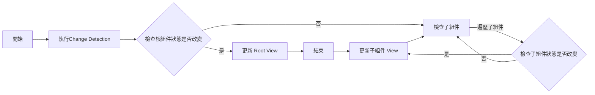

#

現在的前端框架都有屬於自己實作 Reactivity 的機制，Angular 主要是仰賴 zone.js 來處理，zone.js 主要的兩個工作

- 非同步事件結束後的 Change Detection
- 非同步的 stack trace

  當時是無法使用 DevTools 查看非同步的 stack trace ，使用 zone.js 就可以追蹤非同步操作時的狀況，並在 throw error 時，顯示 stack trace 的內容

  參考影片：[Brian Ford - Zones - NG-Conf 2014](https://youtu.be/3IqtmUscE_U?t=391)

在 2014-03 Pearl Chen 發布了一則貼文 [使用 Chrome 開發人員工具對非同步 JavaScript 進行偵錯](https://developer.chrome.com/blog/async-call-stack?hl=zh-tw)
當時的非同步偵錯的功能因為很耗效能，因此預設都是關閉，到了 [2017-07 Chrome 60](https://developer.chrome.com/blog/new-in-devtools-60?hl=zh-tw#step-into-async) 改善了非同步 Stack trace 的效能後正式的預設開啟這功能。

也因 Chrome 改善了 DevTools 提升了開發體驗，使得 zone.js 所提供 stack trace 的美意就沒那麼強烈了

# Angular Change Detection 的工作原理

有兩種狀況會執行 Change Detection

- 每個事件循環週期結束時執行一次
- 手動執行

每次執行 Change Detection 都會從 app-root 往下遍歷檢查是否狀態有改變



當專案越來越龐大時，都要從頭開始檢查，也會造成執行負擔越來越重，因此 [Angular 在官網](https://angular.io/guide/change-detection)也提供了幾種方法改善這個問題

- Zone Pollution: ngZone.runOutsideAngular()
- ChangeDetectionStrategy.OnPush
- Pipe
- cdk-virtual-scroll-viewport

雖然這幾種方法可以改善效能問題，但在剛學習 Angular 的新手也很容易踩到坑

- 沒注意到有開啟 ChangeDetectionStrategy.OnPush ，造成值不會改變
- 在 view 使用 function 計算顯示的值

# Angular Signal

上面講了那麼多，應該能體會到 zone.js 提供的強大威力了吧（抖，因此為了改善種種狀況 Angular 也決定加入了 Signal ，並列了幾個期望同時改善的目標

```html title="RFC: Angular Signals: https://github.com/angular/angular/discussions/49685"
<!-- Angular 擁有清晰統一的模型，說明了數據如何在應用程序中流動。 -->
Angular has a clear and unified model for how data flows through an application.
<!-- 框架內置支持聲明性衍生狀態（一個常見的功能請求）。 -->
The framework has built-in support for declarative derived state (a common
feature request).
<!-- 只有需要更新的 UI 部分應該在單個組件甚至更低的級別上進行同步。 -->
Only the parts of the UI that need updating should be synchronized, at or even
below the granularity of individual components.
<!-- 與 RxJS 等反應式庫的順暢互操作性。 -->
Smooth interoperability with reactive libraries such as RxJS.
<!-- 更好的防護機制，以避免導致差的變更檢測性能的常見陷阱，並避免常見的痛點，如 ExpressionChangedAfterItHasBeenChecked 錯誤。 -->
Better guardrails to avoid common pitfalls that lead to poor change detection
performance and avoid common pain points such as
`ExpressionChangedAfterItHasBeenChecked` errors.
<!-- 一條可行的路徑，可以寫出完全無區塊的應用程序，消除區塊.js 的開銷、陷阱和怪癖。 -->
A viable path towards writing fully zoneless applications, eliminating the
overhead, pitfalls, and quirks of zone.js.
<!-- 簡化許多框架概念，如查詢和生命周期鉤子。 -->
Simplification of many framework concepts, such as queries and lifecycle hooks.
```

# Signal 三元素

假如有寫過 React ，通常對這三個東東會非常的熟悉

- Signal: 可以儲存值，值也可以被改變，也可以通知 Angular 什麼時候該改變
- Computed: 暫存計算完的值，當有使用的 Signal 有改變時，會告知 Computed 再下一次讀取時，需要重新計算
- Effect: 當 Effect 有使用的 Signal 改變時，就會觸發執行

# 範例

import Tabs from '@theme/Tabs';
import TabItem from '@theme/TabItem';

<Tabs>

<TabItem value="ts" label="app.component.ts">

```ts
import { CommonModule } from "@angular/common";
import { Component, computed, effect, signal } from "@angular/core";
import { FormsModule } from "@angular/forms";
import { map, timer } from "rxjs";

@Component({
  selector: "app-root",
  standalone: true,
  imports: [CommonModule, FormsModule],
  templateUrl: "./app.component.html",
})
export class AppComponent {
  formData = signal({
    name: "",
    gender: "",
    height: 0,
    weight: 0,
    city: "",
    area: "",
  });

  // 計算 BMI，當 height 或 weight 有變動時，會重新計算
  bmi = computed(() => {
    const { height, weight } = this.formData();
    if (height && weight) {
      return (Number(weight) / Math.pow(Number(height) / 100, 2)).toFixed(2);
    }
    return "";
  });

  cities = signal<string[]>(["台北市", "新北市"]);
  areas = signal<string[]>([]);

  constructor() {
    // effect 需要放在 constructor 裡面, 不然會噴錯
    effect(() => {
      this.fetchAreas(this.formData().city);
    });
  }

  handleChange(event: Event) {
    const name = (event.target as HTMLInputElement).name;
    const value = (event.target as HTMLInputElement).value;

    // 更新 signal 的方法，提供之前的值，然後回傳新的值
    this.formData.update((prev) => ({ ...prev, [name]: value }));
  }

  handleSubmit(form: HTMLFormElement) {
    if (!form.checkValidity()) {
      return;
    }
    console.log(this.formData());
  }

  fetchAreas(city: string) {
    timer(1000)
      .pipe(
        map(() => {
          switch (city) {
            case "台北市":
              return ["大安區", "信義區"];
            case "新北市":
              return ["板橋區", "新莊區"];
            default:
              return [];
          }
        })
      )
      .subscribe((areas) => {
        // 更新 signal 的方法，直接設值
        this.areas.set(areas);
      });
  }
}
```

</TabItem>

<TabItem value="html" label="app.component.html">

```html
<form #form (ngSubmit)="handleSubmit(form)">
  <div>
    <label htmlFor="name">姓名:</label>
    <input
      type="text"
      id="name"
      name="name"
      [value]="formData().name"
      (change)="handleChange($event)"
      required
    />
  </div>
  <div>
    <label>性別:</label>
    <label htmlFor="male">
      <input
        type="radio"
        id="male"
        name="gender"
        value="male"
        [checked]="formData().gender === 'male'"
        (change)="handleChange($event)"
        required
      />
      Male
    </label>
    <label htmlFor="female">
      <input
        type="radio"
        id="female"
        name="gender"
        value="female"
        [checked]="formData().gender === 'female'"
        (change)="handleChange($event)"
      />
      Female
    </label>
  </div>
  <div>
    <label htmlFor="height">身高:</label>
    <input
      type="number"
      id="height"
      name="height"
      [value]="formData().height"
      (change)="handleChange($event)"
      required
    />
    <label htmlFor="weight">體重:</label>
    <input
      type="number"
      id="weight"
      name="weight"
      [value]="formData().weight"
      (change)="handleChange($event)"
      required
    />
    <span>BMI: {{ bmi() }}</span>
  </div>
  <div>
    <label htmlFor="city">縣市:</label>
    <select
      id="city"
      name="city"
      [value]="formData().city"
      (change)="handleChange($event)"
      required
    >
      <option value="">請選擇</option>
      @for (city of cities(); track $index) {
      <option [value]="city">{{ city }}</option>
      }
    </select>
  </div>
  <div>
    <label htmlFor="area">區域:</label>
    <select
      id="area"
      name="area"
      [value]="formData().area"
      (change)="handleChange($event)"
      required
    >
      <option value="">請選擇</option>
      @for (area of areas(); track $index) {
      <option [value]="area">{{ area }}</option>
      }
    </select>
  </div>
  <button type="submit">送出</button>
</form>
```

</TabItem>
</Tabs>

# 結論

目前看來之後在開發 Angular 的專案可以少踩不少坑了，雖然目前 Signal 的功能有限，但非常期待未來朝向這個目標發展的 angular 框架，謝謝各位大神在這個領域的貢獻（跪

# 參考文件

- [Angular Blog - Angular v16 is here!](https://blog.angular.io/angular-v16-is-here-4d7a28ec680d)
- [Brian Ford - Zones - NG-Conf 2014](https://www.youtube.com/watch?v=3IqtmUscE_U)
- [RFC: Angular Signals](https://github.com/angular/angular/discussions/49685)
- [Angular change detection and runtime optimization](https://angular.io/guide/change-detection)
